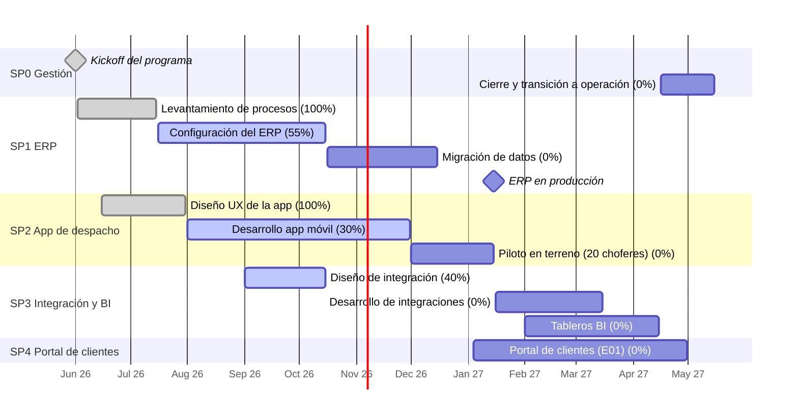

# Carta Gantt

Generada el 2026-09-25 desde `cronograma.csv`. No editar a mano.

```mermaid
gantt
    dateFormat YYYY-MM-DD
    axisFormat %b %y
    todayMarker on
    section SP0 Gestión
    Kickoff del programa :done, milestone, T01, 2026-06-01, 0d
    Cierre y transición a operación (0%) :T13, 2027-04-16, 2027-05-15
    section SP1 ERP
    Levantamiento de procesos (100%) :done, T02, 2026-06-02, 2026-07-15
    Configuración del ERP (55%) :active, T03, 2026-07-16, 2026-10-15
    Migración de datos (0%) :T04, 2026-10-16, 2026-12-15
    ERP en producción :milestone, T05, 2027-01-15, 0d
    section SP2 App de despacho
    Diseño UX de la app (100%) :done, T06, 2026-06-15, 2026-07-31
    Desarrollo app móvil (30%) :active, T07, 2026-08-01, 2026-11-30
    Piloto en terreno (20 choferes) (0%) :T08, 2026-12-01, 2027-01-15
    section SP3 Integración y BI
    Diseño de integración (40%) :active, T09, 2026-09-01, 2026-10-15
    Desarrollo de integraciones (0%) :T10, 2027-01-16, 2027-03-15
    Tableros BI (0%) :T11, 2027-02-01, 2027-04-15
    section SP4 Portal de clientes
    Portal de clientes (E01) (0%) :T12, 2027-01-04, 2027-04-30
```
