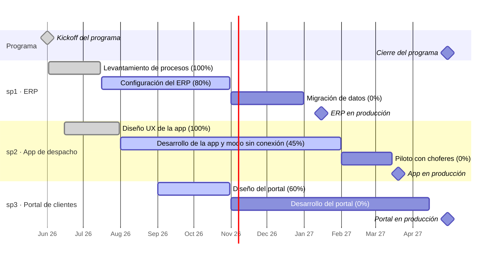

# Carta Gantt detallada del programa

Generada el 2026-10-15 desde `consolidado.csv`. No editar a mano.

```mermaid
gantt
    dateFormat YYYY-MM-DD
    axisFormat %b %y
    todayMarker on
    section Programa
    Kickoff del programa :done, milestone, PRGT01, 2026-06-01, 0d
    Cierre del programa :milestone, PRGT02, 2027-04-30, 0d
    section sp1 · ERP
    Levantamiento de procesos (100%) :done, sp1T01, 2026-06-02, 2026-07-15
    Configuración del ERP (80%) :active, sp1T02, 2026-07-16, 2026-10-31
    Migración de datos (0%) :sp1T03, 2026-11-01, 2026-12-31
    ERP en producción :milestone, sp1T04, 2027-01-15, 0d
    section sp2 · App de despacho
    Diseño UX de la app (100%) :done, sp2T01, 2026-06-15, 2026-07-31
    Desarrollo de la app y modo sin conexión (45%) :active, sp2T02, 2026-08-01, 2027-01-31
    Piloto con choferes (0%) :sp2T03, 2027-02-01, 2027-03-15
    App en producción :milestone, sp2T04, 2027-03-20, 0d
    section sp3 · Portal de clientes
    Diseño del portal (60%) :active, sp3T01, 2026-09-01, 2026-10-31
    Desarrollo del portal (0%) :sp3T02, 2026-11-01, 2027-04-15
    Portal en producción :milestone, sp3T03, 2027-04-30, 0d
```
