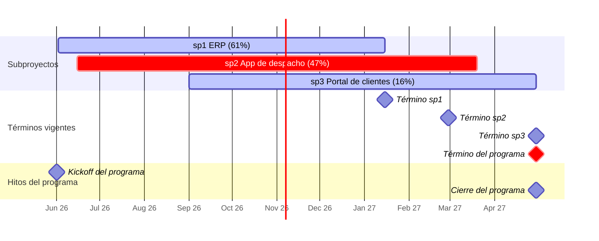

# Carta Gantt macro del programa

Generada el 2026-10-15 con `programa.py`. No editar a mano: una barra por subproyecto y los hitos contractuales.

```mermaid
gantt
    dateFormat YYYY-MM-DD
    axisFormat %b %y
    todayMarker on
    section Subproyectos
    sp1 ERP (61%) :active, sp1, 2026-06-02, 2027-01-15
    sp2 App de despacho (47%) :crit, sp2, 2026-06-15, 2027-03-20
    sp3 Portal de clientes (16%) :active, sp3, 2026-09-01, 2027-04-30
    section Términos vigentes
    Término sp1 :milestone, 2027-01-15, 0d
    Término sp2 :milestone, 2027-02-28, 0d
    Término sp3 :milestone, 2027-04-30, 0d
    Término del programa :milestone, crit, 2027-04-30, 0d
    section Hitos del programa
    Kickoff del programa :milestone, 2026-06-01, 0d
    Cierre del programa :milestone, 2027-04-30, 0d
```
