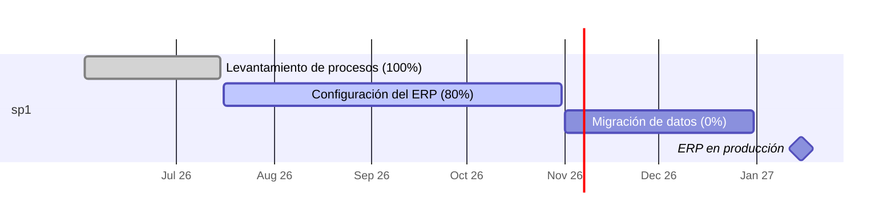

# Carta Gantt sp1 · ERP

Generada el 2026-10-15 desde `cronograma.csv`. No editar a mano.

```mermaid
gantt
    dateFormat YYYY-MM-DD
    axisFormat %b %y
    todayMarker on
    section sp1
    Levantamiento de procesos (100%) :done, T01, 2026-06-02, 2026-07-15
    Configuración del ERP (80%) :active, T02, 2026-07-16, 2026-10-31
    Migración de datos (0%) :T03, 2026-11-01, 2026-12-31
    ERP en producción :milestone, T04, 2027-01-15, 0d
```
